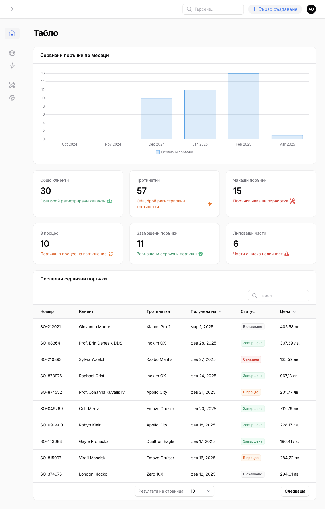

# E-scooter service management system

A modern scooter service management system built with Laravel and Filament.



## About

Serviz2 is a comprehensive solution for scooter service shops to manage customers, scooters, service orders, and spare parts inventory.

## Key Features

- Customer management
- Scooter tracking with service history
- Service order creation and management
- Spare parts inventory
- Dashboard with stats and charts
- Label printing for service orders
- Notification system (email and SMS)

## Technologies

- Laravel
- Filament Admin Panel
- MySQL
- Vonage SMS API

## Notification System
The system includes a robust notification framework:

1. **Email Notifications**
   - Service order status updates
   - Payment confirmations

2. **SMS Notifications via Vonage**
   - Service order ready for pickup alerts
   - Important status updates

### Configuring Vonage SMS
To use the SMS notification feature, you need to set up the Vonage API credentials in your `.env` file:

```
VONAGE_KEY=your_api_key
VONAGE_SECRET=your_api_secret
VONAGE_SMS_FROM=SERVIZ
```

## Testing
To run the tests:
```bash
php artisan test
```

To run specific tests:
```bash
# Run all notification tests
php artisan test tests/Feature/Notifications/

# Run specific test file
php artisan test tests/Feature/Notifications/ServiceOrderReadyForPickupTest.php
```

## Development

**Claude Code played a transformative role in creating this project.** It helped with:

- Building the data model and migrations
- Generating Filament resources and relation managers
- Creating dashboard widgets and charts
- Implementing service label printing functionality
- Debugging complex issues
- Optimizing queries and performance
- Creating tests for notifications

Claude's ability to understand the codebase structure and architectural patterns was instrumental in accelerating development from concept to completion.

## License

MIT